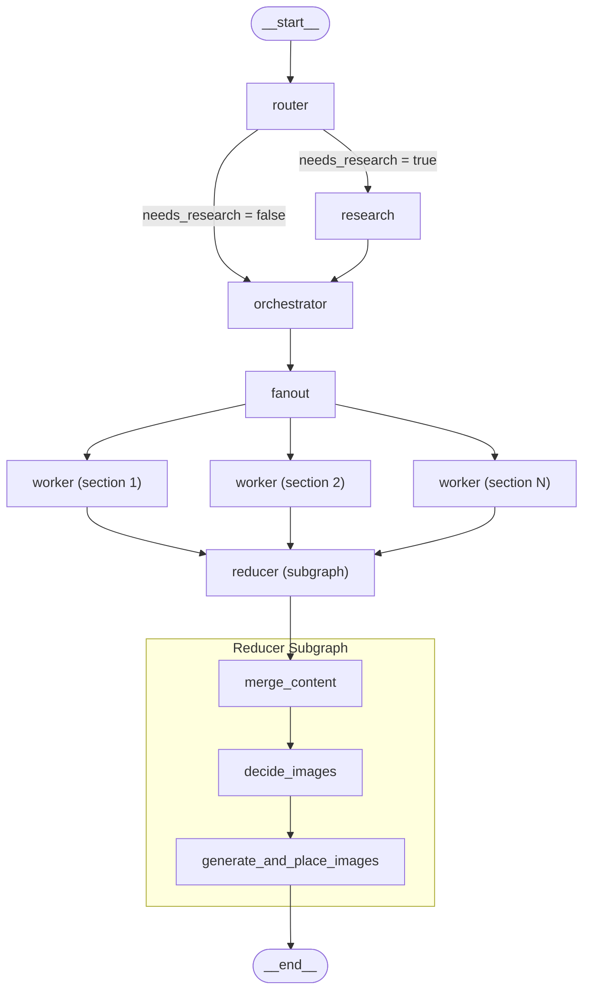

```mermaid
flowchart TD
    A(["__start__"]) --> B["router"]

    B -->|needs_research = true| C["research"]
    B -->|needs_research = false| D["orchestrator"]
    C --> D

    D --> E["fanout"]
    E --> F1["worker (section 1)"]
    E --> F2["worker (section 2)"]
    E --> F3["worker (section N)"]

    F1 --> G["reducer (subgraph)"]
    F2 --> G
    F3 --> G

    subgraph R["Reducer Subgraph"]
      G1["merge_content"]
      G2["decide_images"]
      G3["generate_and_place_images"]
      G1 --> G2 --> G3
    end

    G --> G1
    G3 --> Z(["__end__"])
```
